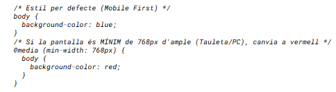

# Diseño Responsive 

## ¿Por qué es importante el diseño responsive?

Antes de entrar en la técnica, es fundamental entender por qué este es el requisito número uno del desarrollo web actual:

- **Hábitos de consumo:** Más del 60% del tráfico web mundial proviene de dispositivos móviles. Si tu web no funciona al móvil, estás ignorando la mayoría de tus usuarios.

- **SEO (Posicionamiento en Google):** Google utiliza el Mobile-*First Indexing. Esto quiere decir que Google mira primero la versión móvil de tu web para decidir en qué posición sales a los resultados. Si no es responsiva, Google te penaliza.

- **Experiencia de Usuario (UX):** Un usuario que tiene que hacer "zoom" con los dedos para leer un texto o moverse horizontalmente para ver una imagen se frustra y marcha.

- **Eficiencia:** Antiguamente se hacían dos webs (una para PC y una "m.web.com" para móvil). Con el diseño responsiu, solo mantienes un único código que sirve para todo, ahorrando tiempo y dinero.

## Responsive vs adaptative

### Diseño Responsiu (Responsive Web Design - RWD)

- **Concepto:** El diseño es fluido, como el agua. Se adapta en el espacio disponible milímetro a milímetro.

- **Cómo funciona:** Utiliza parrillas flexibles (%), imágenes fluidas y CSS Media Queries. Si estiras la ventana del navegador, el contenido se reajusta continuamente.

- **Ventaja:** Cubre cualquier medida de pantalla, incluso las que todavía no existen. Es el estándar actual (gracias a frameworks como Bootstrap o Tailwind).

### Diseño Adaptativo (Adaptive Web Design - AWD)

- **Concepto:** El diseño hace saltos (snaps). Tiene diseños "fijos" predefinidos para medidas concretas de dispositivos.

- **Cómo funciona:** Detecta el dispositivo (o la anchura) y carga la plantilla estática diseñada específicamente para aquella medida (ex: una versión para 320px, otra para 768px, otra para 1024px).

## Responsive vs adaptive


## Extrategias de diseño

Cómo empezamos a diseñar? Hay dos filosofías principales:

### Mobile first

- Estrategia: Empiezas diseñando la versión de pequeña pantalla (móvil) con los estilos baso. Después, añades código para pantallas más grandes (min-*width).
- Por qué es mejor: Te obliga a priorizar el contenido esencial (a la pequeña pantalla no cabe todo). El código suele ser más ligero y rápido. Es la tendencia recomendada hoy en día.

### Desktop first

- Estrategia: Empiezas diseñando la web completa para ordenador. Después, intentas meterlo todo en pantallas pequeñas usando max-*width para esconder o reducir cosas.
- Problema: A menudo acaba con webs móviles lentas que cargan recursos innecesarios.

## Media queries

Las media queries son la tecnología base que hace posible el diseño responsiu. Son "condicionales" dentro de tu CSS (como un if en programación).



- **Breakpoints:** Son los píxeles donde el diseño cambia. Los más habituales son:

- 576px (Móviles apaisados)
- 768px (Tabletas)
- 992px (Portátiles)
- 1200px (Escritorios grandes)

## Frameworks CSS

Son librerías de código que nos ayudan a diseñar más rápidamente sin empezar de cero.

- **Bootstrap:** Es lo más clásico. Te da "componentes" ya hechos (botones, barras de navegación, tarjetas). Es muy útil para principiantes porque con pocas clases tienes una web funcional.

- **Tailwind CSS:** Es la tendencia actual. No te da componentes hechos, sino "utilidades" (clases pequeñas como texto-center, p-4, bg-*red-500). Te permite construir diseños totalmente personalizados sin salir del HTML.

## Sistemas de maquetación

Antes se usaba float, pero ahora tenemos dos sistemas muy potentes para colocar los elementos en la pantalla:

- Flexbox (Flexible Box):
    - Ideal para una sola dimensión (una fila o una columna).
    - Uso típico: Centrar un elemento dentro de un div, alinear los elementos de un menú de navegación horizontalmente.
- CSS Grid:
    - Ideal para dos dimensiones (filas y columnas a la vez).
    - Uso típico: Crear el esqueleto general de la página (cabecera, barra lateral, contenido principal, pie de página).

## Compatibilitat i accessibilitat

La web tiene que ser para todo el mundo, independientemente del navegador o las capacidades del usuario.

- **Compatibilidad (Cross-browser):** Asegurarse que la web se ve bien en Chrome, Firefox, Safari y Edge. A veces hay que añadir prefijos (como -webkit-) o utilizar herramientas como Autoprefixer.

- **Acceso Universal (Accesibilidad):** Utilizar HTML semántico (<(nav)>, <(main)>, <(footer)> en lugar de solo <(div)>) ayuda los lectores de pantalla y mejora lo SEO.

## Compatibilidad entre navegadores

Igual que en los idiomas hay dialectos, los navegadores web no "leen" el código exactamente igual. Cada navegador utiliza un motor de renderizado diferente para interpretar el HTML y lo CSS que nosotros escribimos.

Los motores principales son:

- **Blink:** Google Chrome, Microsoft Edge, Opera, Brave.
- **WebKit:** Safari (guapos y iOS). Es lo más "remirado" actualmente.
- **Gecko:** Mozilla Firefox.

Cuando el organismo que regula la web (W3C) crea una nueva norma CSS (por ejemplo, una animación nueva), cada motor lo implementa a su ritmo. Esto crea situaciones donde una propiedad funciona en Chrome pero todavía no a Safari.

### Vendor prefixes
Son etiquetas que los fabricantes de navegadores añaden a las propiedades CSS nuevas o experimentales antes de que sean 100% estándar. Los prefijos más comunes son:

- -webkit-: Para Chrome, Safari, versiones nuevas de Opera y Edge, y casi todos los navegadores de móvil (iOS/Android).
- -moz-: Para Firefox.
- -ms-: Para Internet Explorer y versiones viejas de Edge.
- -o-: Para versiones viejas de Opera (ya casi no se usa).

#### Ejemplo


Escribir los prefijos a mano hoy en día es un error: es fácil olvidarse uno, ensucia el código y costa de mantener.

La solución profesional es utilizar herramientas de automatización como Autoprefixer.

- **Qué hace:** Es un programa que lee tu CSS normal y limpio.
- **Cómo lo hace:** Consulta una base de datos gigante llamada Can I Uso para saber qué propiedades necesitan prefijos hoy en día.
- **Resultado:** Tú escribes display: flex; y Autoprefixer, automáticamente, añade -webkit-box, -ms-flexbox, etc., si hace falta, cuando compilas el código.

Esta herramienta suele venir integrada en frameworks como Bootstrap, Tailwind o cuando utilizas herramientas como Vite, Webpack o VS Code extensiones.

**Herramienta indispensable: "Can I Uso?"**

Cómo sabes si una propiedad CSS (por ejemplo gap en Flexbox) funcionará en el iPhone de un usuario que no ha actualizado el móvil en 3 años?

Utilizando la web caniuse.com.

- Es la "biblia" de la compatibilidad.
- Buscas una propiedad y te muestra una mesa verde (soportado) o roja (no soportado) para cada navegador y versión.
- Te dice si necesitas prefijos o si hay errores conocidos (bugs).

## Procesadores CSS (Sass/SCSS)

Los navegadores solo entienden CSS. Pero escribir CSS puro en proyectos grandes puede ser repetitivo y difícil de mantener. Los preprocesadores como Sass (Syntactically Awesome Style Sheets) son herramientas que nos permiten escribir código que después se traduce (compila) automáticamente a CSS normal.

Sass es un motor que lee

Lenguajes de Sass:scss y Sass


Es fácil confundirse porque la palabra "Sass" se usa para dos cosas diferentes. Aquí tenso la distinción exacta:

- El Motor: se llama Sass. Es el programa que instalas al ordenador (el preprocesador). Su trabajo es leer tus ficheros y traducirlos a CSS.

- El Lenguaje: puede ser SCSS o Sass. Son las dos maneras de escribir las instrucciones para el motor.
    - SCSS (.scss): Utiliza claves {} y ;. Es el que usaremos (recomendado).
    - Sass (.sass): Utiliza indentació. Es el antiguo

### Ventajas

- **Variables**

En CSS puro (antes de las Custom Properties), si querías cambiar el color principal de la web, tenías que buscar y sustituir el código hexadecimal 50 veces. Con Sass, guardas el valor en una variable.


### Nidificación (Nesting)

En CSS normal, tienes que repetir el selector padre constantemente (.nav, .nav le, .nav le a). En Sass, escribes los estilos siguiendo la jerarquía visual del HTML.


### Mixins (funciones reutilizable)

Puedes crear bloques de código reutilizables por no escribir el mismo repetidamente.

````
@mixin flex-centre {
  display: flex;
  justify-content: center;
  align-items: center;
}

.hero-section {
  @include flex-centre; /* Aplica les 3 línies de cop */
  height: 100vh;
}

````

### Modularitat

Puedes dividir tu CSS en ficheros pequeños (_header.scss, _footer.scss, _variables.scss) e importarlos todos en un fichero principal. Esto hace que el proyecto sea mucho más fácil de ordenar.

### Lógica Avanzada: Funciones y Condicionales

**Funciones (@function):** A diferencia de los Mixins (que generan bloques de código CSS), las funciones sirven para calcular y devolver un valor concreto (como un número o un color).

````
@function a-rem($pixels) {
  /* Divideix els píxels per 16 (base estàndard) i retorna rems */
  @return ($pixels / 16) * 1rem;
}

.titol-gran {
  /* Cridem la funció i Sass fa la matemàtica per nosaltres */
  font-size: a-rem(32); /* El CSS final serà: font-size: 2rem; */
}

````

**Condicionales (@if / @else):** Puedes aplicar estilos diferentes segundos el valor de una variable. Es muy útil para crear temas o componentes configurables.

````
$tema-actual: 'fosc'; /* Canvia això a 'clar' i tot canvia automàticament */

body {
  @if $tema-actual == 'fosc' {
    background-color: #1a1a1a;
    color: #ffffff;
  } @else {
    background-color: #ffffff;
    color: #333333;
  }
}

````

### Bucles

Los bucles permiten repetir código de manera automática, cosa muy útil para generar clases de utilidad (como hace Tailwind o Bootstrap).

````
/* Definim una llista de colors (mapa) */
$colors: (
  'primari': blue,
  'error': red,
  'exit': green
);

/* El bucle crea una classe per a cada color */
@each $nom, $valor in $colors {
  .bg-#{$nom} {
    background-color: $valor;
  }
}

/* Resultat CSS compilat:
   .bg-primari { background-color: blue; }
   .bg-error { background-color: red; }
   .bg-exit { background-color: green; }
*/

````

### Herencia 

La herencia permite que un selector "herede" todos los estilos de otro selector. Es ideal para evitar duplicar código en elementos que son variantes de un mismo tipo.

````
/* Estil base comú per a tots els missatges */
.missatge-base {
  border: 1px solid #ccc;
  padding: 10px;
  border-radius: 4px;
  font-weight: bold;
}

.missatge-error {
  @extend .missatge-base; /* Copia tot lo d'adalt aquí */
  background-color: #ffe6e6;
  color: red;
}

.missatge-exit {
  @extend .missatge-base; /* Copia tot lo d'adalt aquí */
  background-color: #e6fffa;
  color: green;
}
````

### Cómo usarlo?
Para que el navegador entienda tu código Sass, necesitas seguir este proceso de 4 pasos. Aquí verás la diferencia entre elegir SCSS o Sass.

1. **Instalar el Compilador:**
    - Si utilizas VS Code, instala la extensión Live Sass Compiler (de Glenn Marks). Este paso es idéntico para ambos formatos.

2. **Crear y Escribir (Aquí eliges el formato):** Es el momento de decidir qué sintaxis quieres.
    - Opción A (SCSS - Recomendada):
        - Crea un fichero llamado estilos.scss.
        - Escribe usando claves {} y punto y coma ;, igual que en CSS.

    - Opción B (Sass - Original):
        - Crea un fichero llamado estilos.sass.
        - Escribe usando indentació (tabulaciones), sin claves ni punto y coma.
        - Más rápido de escribir, pero requiere ser muy estricto con los espacios.

3. **Compilar (Traducir):**
    - Fez clic al botón "Watch Sass" que aparece a la barra inferior del VS Code.
    - El compilador detectará automáticamente la extensión (.scss o .sass) y la traducirá.
    - Resultado: En ambos casos, se generará exactamente el mismo fichero: estilos.css.

4. **Vincular al HTML:**
- Este paso **NO cambia nunca**. A tu fichero .HTML, tienes que gritar siempre el fichero resultante (.css). El navegador no sabe (ni le importa) si lo has creado con Sass o SCSS.

````
<!-- CORRECTE (Sempre el .css) -->
<link rel="stylesheet" href="estils.css">
<!-- INCORRECTE (Mai enllacis .scss ni .sass) -->
<link rel="stylesheet" href="estils.scss">

````