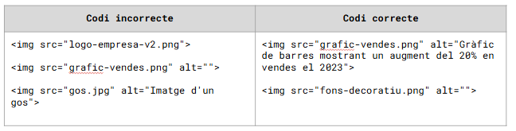
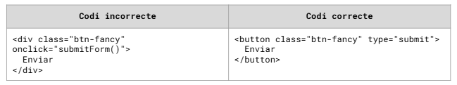
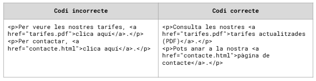
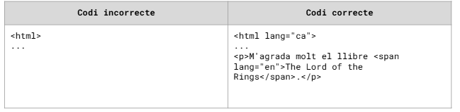

# Disseny  de webs accessibles

## Què és l’accessibilitat web?

La accesibilidad web significa que sitios web, herramientas y tecnologías se encuentran diseñadas y desarrolladas de tal manera que las personas con alguna discapacidad las pueden utilizar. Pueden hacer:
- Percibir, comprender, navegar e interactuar con la Web.
- Hacer contribuciones en la web

La accesibilidad web abarca todas las discapacidades que afectan al acceso web, incluyente:
- auditivas, cognitivas, neurológicas, físicas, del habla y visuales.

Otros casos que no tienen que ver con tener ninguna discapacidad:

- personas utilizando teléfonos móviles, relojes inteligentes, televisores inteligentes y otros dispositivos con pantallas pequeñas, diferentes modas de entrada, etc.

- gente mayor las habilidades del cual cambian con la edad

- personas con “discapacidades temporales”, como por ejemplo un brazo roto o la pérdida de unas ojeras

- personas con “limitaciones por su ubicación”, como puede ser bajo la luz del sol o en un entorno donde no se puede escuchar audio.

- personas con conexión lenta a Internet o que tienen ancho de banda limitado o costoso.

## El Consorcio World Wide Web (W3C)

### Función

Dentro del W3C existe un grupo de trabajo específico: la WAI (Web Accessibility Initiative). Su función es desarrollar estrategias, pautas y recursos para hacer la Web accesible para personas con discapacidad.

Raíz de esto aparecen las WCAG (Web Contento Accessibility Guidelines), que son el estándar técnico que los desarrolladores tenemos que implementar.

### Por qué es importante?

- **Professionalidad:** 
Seguir los estándares del W3C distingue un programador profesional de un aficionado.
- **Estabilidad:** Permet l'ús del text de manera anònima per a millorar el servei de traducció
El código basado en estándares es más fácil de mantener y dura más años.
- **Inclusión:** El W3C nos da las herramientas técnicas por no discriminar a ningún usuario.

## WCAG

### Significado

Web Content Accessibility Guidelines (Pautas de Accesibilidad al Contenido Web).

### Concepto

Son documentos técnicos que explican cómo hacer que el contenido web sea accesible para personas con discapacidad.
Las WCAG son el estándar mundial. Son la base de la legislación europea (EN 301 549) y la normativa española. Si una empresa pide "una web accesible por ley", está pidiendo cumplir las WCAG

### Principis (POUR)

Cualquier problema de accesibilidad cae en una de estas 4 categorías.

- **P - Perceptible:** La información y los componentes de la interfaz tienen que ser mostrados a los usuarios de forma que les puedan percibir (con la vista, el oído o el tacto). Ejemplo: Texto alternativo a las imágenes para quienes no ve.

- **O - Operable:** Los componentes de la interfaz y la navegación tienen que ser operables. El usuario tiene que poder interactuar.

**Ejemplo:** Poder navegar solo con el teclado (sin ratón).

- **Uno - Understandable (Comprensible):** La información y el funcionamiento de la interfaz tienen que ser comprensibles. Ejemplo: Idioma de la página definido, mensajes de error claros.

- **R - Robusto:** El contenido tiene que ser bastante robusto para ser interpretado de manera fiable por una amplia variedad de agentes de usuario (navegadores y productos de apoyo). 

**Ejemplo:** Código HTML válido, sin etiquetas rotas que confundan un lector de pantalla.

### Nivells de conformitat

Como desarrolladores, necesitamos saber "qué nota" tenemos que sacar.

- **Nivel A (Mínimo)** - Ejemplo: Navegación por teclado básica.
Son los requisitos más básicos.

Si no se cumplen, la web es imposible de utilizar para ciertos grupos.

- **Nivel AA (El Estándar)** - Ejemplo: Contraste de colores suficiente, foco visible.

Incluye todos los del nivel A + nuevos requisitos.

- Es el nivel que exigen la mayoría de leyes y administraciones públicas.
- Es el objetivo habitual de un proyecto web profesional.

- **Nivel AAA (La Excelencia)**
El nivel más alto. Muy difícil de conseguir en todo el contenido (por ejemplo, videos en lengua de signos).

Se reserva para lugares muy específicos.

### Versiones

- WCAG 2.0 (2008): La antigua base sólida.

- WCAG 2.1 (2018): El estándar actual más extendido a nivel legal. Añadió muchas mejoras para dispositivos móviles y personas con baja visión o discapacidades cognitivas.

- WCAG 2.2 (2023): La versión más reciente. Añade criterios nuevos (por ejemplo, hacer más fácil la autenticación sin contraseñas complejas o mejorar el área de clic en botones).

- WCAG 3.0 (Proyecto): Todavía en borrador, cambiará mucho la manera de puntuar, pero todavía faltan años.

Hoy en día, si empezáis un proyecto, intentáis cumplir la 2.2, pero como mínimo tenéis que garantizar la 2.1 AA.

### Técnicas

**Concepto**
**Built-*in beatos Bolt-donde** (El que viene integrado supera el que se añade después).

HTML nativo (<button>, <input>, <nav>) ya es accesible de serie. Siempre que podáis, usáis la etiqueta correcta en lugar de inventaros ruedas con divs y mucho de JavaScript.

A continuación, veremos diferentes técnicas para hacer que nuestra página web sea accesible.

#### Técnica 1: Imágenes y Texto Alternativo

**WCAG Criterio: 1.1.1 Contenido no textual (Nivel A)**

Si no pones alto, un lector de pantalla leerá el nombre del archivo (ex: "IMG_2023.jpg"), lo cual es inútil.

#### Técnica 2: Formularios y Etiquetas (Labelos)

**WCAG Criterio: 1.3.1 Información y Relaciones (Nivel A)**

Lo placeholder NO es una etiqueta. Desaparece cuando escribes y muchos lectores de pantalla no lo leen correctamente como nombre del campo.

#### Técnica 3: Botones vs. Divs (Semántica)

**WCAG Criterio: 2.1.1 Teclado (Nivel A)**

Un div no recibe el foco del teclado (Tab) y no dice al lector de pantalla "soy un botón". Hacer un div clicable con JS es una mala práctica de accesibilidad (y de programación).

Si realmente tienes que usar un div, tienes que añadir role="*button" y tabindex="0" a pesar de que usara HTML nativo siempre que puedas.

#### Técnica 4: Enlaces con contexto

**WCAG Criterio: 2.4.4 Propósito de los enlaces (Nivel A)**

Los usuarios de lectores de pantalla a menudo navegan saltando de enlace en enlace. Si escuchan una lista de 10 enlaces que dicen "Clica aquí", no saben donde van.

#### Técnica 5: Idioma de la página

**WCAG Criterio: 3.1.1 Idioma de la página (Nivel A)**

Si no defines el idioma, el lector de pantalla intentará leer texto en catalán con acento inglés (o el que tenga por defecto el usuario), haciéndolo ininteligible.

#### Técnica 6: Uso correcto de ARIA (aria-labelo) - Cuando el HTML nativo se queda corto.

A veces el diseño nos "obliga" a eliminar texto visible (por ejemplo, el icono de una lupa, una "X" para cerrar o un menú hamburguesa). Aquí es donde haremos uso de ARIA.

Un botón que solo contiene un icono (SVG o FontAwesome) es invisible para un lector de pantalla si no le damos un nombre.

#### Técnica 7: Contraste de Color (Nivel AA)

**WCAG Criterio: 1.4.3 Contraste (Mínimo) - Nivel AA**

Esta es el fallo más común a internet. Para cumplir el nivel AA, el texto normal tiene que tener una ratio de contraste de 4.5:1 respecto al fondo.

## Herramientas de análisis de accesibilidad web

### WAVE (Web Accessibility Evaluation Tool)

- Una extensión del navegador (Chrome/Firefox) desarrollada por WebAIM.
- Es muy visual.
    - Inyecta iconos directamente sobre la página web que estás visitando.
    - Rojo = Error, Verd = Característica accesible, Amarillo = Alerta.
### Google Lighthouse

- Herramienta de auditoría integrada dentro de las Chrome DevTools (Pestaña "Lighthouse").
- Nos da una puntuación (del 0 al 100).
- Aparte de decirte el error, te da un enlace directo a la documentación de cómo arreglarlo. Ideal para aprender mientras programas.

### Chrome DevTools: CSS Overview

- Función específica del inspector de elementos (hay que activarla o buscarla a "More tools").
- Hace una radiografía de los colores y tipografías.
- Te lista todos los colores utilizados en la página.
- Te dice qué combinaciones de color de fondo/texto no cumplen la ratio de contraste AA o AAA.

### Figma (Diseño y Prototipaje)
- La herramienta estándar de diseño de interfaces.
- Permite arreglar los problemas antes de escribir ni una línea de código.