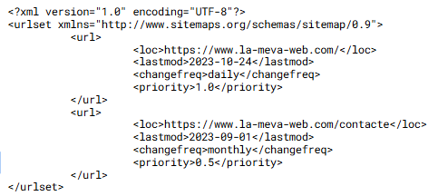

# SEO

## Concepto
El SEO es el conjunto de acciones que hacemos para, cuando alguien busque algo en Google relacionada con nuestra web, salimos los primeros sin pagar.

El objetivo es aparecer a la SERPIENTE en las posiciones orgánicas.
Los buscadores son robots ciegos que leen código HTML. Si el código está sucio o mal estructurado, el robot no entiende la web y no la muestra.

**Diccionario:**

- **SERP (Search Engine Results Page):** Es la página que voces justo después de clicar "Buscar" en Google. Es la lista de resultados.

- **Resultado Orgánico:** Son los resultados "naturales". Están allá porque Google cree que son buenos, no para que la empresa haya pagado.

- **Resultado de Pago (SEM):** Los anuncios que salen arriba de todo con la etiqueta "Patrocinado". Esto NO es SEO.

## ¿Cómo funciona google por dentro?

Imaginad Google como una biblioteca infinita, pero sin bibliotecarios humanos. Todo lo hacen scripts.

- **Rastreo (Crawling):** Google envía unos programas llamados Spiders o Botes a navegar por internet. Viajan saltando de un enlace <(a href)> a otro.

- **Indexación (Indexing):** Cuando el Bot encuentra una página, se descarga el código (HTML, CSS, JS), lo analiza y el guarda a su BD gigante. Si no estás al índice, no existes.

- **Ranking:** Cuando un usuario hace una consulta, el algoritmo busca a la base de datos y ordena los resultados según la relevancia.

**Diccionario:**

- **Spider / Bot / Crawler:** Es un script (programa automático) que visita webs las 24h del día. El de Google se llama Googlebot.

- **Algoritmo:** La fórmula matemática secreta de Google que decide quién sale primero. Tiene en cuenta más de 200 factores (velocidad, palabras, enlaces, etc.).

## Dónde podemos actuar nosotros (on-page)

Esto es todo el que depende directamente de vuestro código y del servidor.

- **Palabras Clave (Keywords):** Son las palabras que el usuario escribe al buscador (ex: "comprar portátil barato"). Tenemos que asegurarnos que estas palabras salen a nuestro texto y títulos.

- **Las Meta Etiquetas:** Código a la cabecera (<head>) que no se ve en la web, pero que habla con Google.
- <(title)>: El título azul que sale a Google.
- <(meta description>): El pequeño resumen gris de debajo.
- Velocidad de carga (WPO): Si la web tarda más de 3 segundos, Google la penaliza.

**Diccionario:**

- **Keywords (Palabras Clave):** Los términos de búsqueda por los cuales queremos ser encontrados.
- **WPO (Web Performance Optimization):** Técnicas para hacer que la web cargue muy rápido (comprimir imágenes, minificar CSS/*JS).

## ¿Qué dicen de nosotros? (off-page)

Esto es el que pasa fuera de nuestra web.

- Google no solo mira tu código, mira tu Autoridad.
- Cómo se mide la autoridad? Principalmente por los Backlinks.
- Si la web de la NASA pone un enlace hacia tu web, Google piensa que es fiable y te sube posiciones.
- Si te enlaza una web de spam o de baja calidad, no sirve de nada.

**Diccionario para principiantes:**

- **Backlink (Enlace entrante):** Un enlace <(a)> en otra página web que apunta hacia la tuya. Es como un "voto de confianza" a internet.
- **Autoridad de Dominio:** Una puntuación (no oficial) que predice como de "famosa" o fiable es tu web en los ojos de Google.

## SEO Técnica

La relación entre el código y lo SEO.

- HTML Semántico: Google "lee" la web de manera muy parecida a un ciego con lector de pantalla. <(h1)> es importante; div con letra grande no lo es.

- Imágenes: Los robots no ven fotos. Necesitan el atributo alto="descripción" por saber que hay.

- Meta Etiquetas:
    - <(title)>: El factor más importante de la página.
    - <(meta name="description")>: El resumen que sale a Google.

- Archivos de control:
    - robots.txt: Dice a bote pronto donde no puede entrar (ex: panel de administración).
    - sitemap.xml: Un mapa para ayudar a bote pronto a encontrar todas las páginas.

- Performance (Core Web Vitales): Si la web es lenta, Google la penaliza.

- Mobile First: Google prioriza la versión móvil. Si la web se ve mal al móvil, no saldrás primero al ordenador.

- URLs Limpias:
    - Bien: miweb.com/productes/sabatilles-esport (Se lee y se entiende).
    - Mal: miweb.com/index.php?id=342&cat=9 (El robot no sabe de qué va).

## Robots.txt

Es un fichero de texto plano (sin HTML) que tiene que estar siempre en la raíz del dominio (domini.com/robots.txt). 

- **Función:** dar instrucciones a los bots sobre qué rutas pueden visitar y qué no.

- **Explicación:**

- **User-agente:** Define a quién hablamos. * quiere decir "a todo el mundo". Googlebot quiere decir solo a Google.
- **Disallow:** Prohibido entrar aquí. Muy útil para evitar que Google indexe el panel de administración (/admin) o carpetas temporales.
- **Allow:** Puedes entrar aquí. Sirve para hacer excepciones dentro de una carpeta bloqueada.
- **Sitemap:** Es obligatorio ponerlo al final para decirle a bote pronto donde encontrar el mapa del web.

## Sitemap.xml

Un fichero en formato XML que lista todas las URLs que queremos que se indexen.

- **Función:** Ayuda a bote pronto a descubrir páginas que quizás no tienen muchos enlaces o son muy nuevas.

- **Explicación:**

- **<(urlset)>:** Lo etiqueta raíz que abre y valla el documento.
- **<(url)>:** Cada página individual.
- **<(loc)> (Location):** La URL completa. Obligatorio.
- **<(lastmod)>:** Fecha de la última modificación. Clave para que Google sepa si tiene que volver a pasar.
- **<(changefreq)>:** Con qué frecuencia cambia el contenido (diario, semanal, mensual). Es una pista para el bote, no una orden.
- **<(priority)>:** Un número del 0.0 al 1.0. Indica la importancia de aquella página dentro de tu propio web. La Hombre suele ser 1.0.

## SEO vs SEM

### SEO (Search Engine Optimization):

- Resultados orgánicos (gratuitos por clic).
- Estrategia a largo plazo (meses/años).
- Se basa en la calidad y relevancia..

### SEM (Search Engine Marketing - Google Ads):

- Resultados de pago (etiqueta "Patrocinado").
- Inmediato (pagas y sales).
- Cuando dejas de pagar, desapareces.

