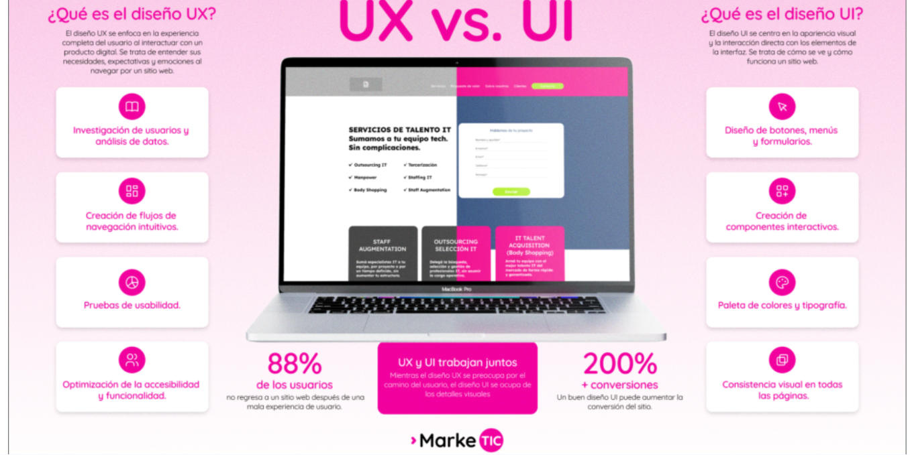

# Usabilidad web

## ¿Qué es la usabilidad web?

La usabilidad de un sitio web se refiere a la medida en que un usuario puede interactuar con el lugar de manera efectiva, eficiente y satisfactoria para conseguir sus objetivos. En otras palabras, un sitio web con alta usabilidad es fácil de usar y proporciona una experiencia positiva para sus usuarios.

- Usabilidad: poder hacer una tarea en el menor tiempo posible.

- **Eficacia:** Los usuarios pueden completar las tareas?
- **Eficiencia:** Cuántos recursos (tiempos/esfuerzo) se necesitan?
- **Satisfacción:** La experiencia es agradable?

## IU vx UX

| | UI (User Interface) | UX (User Experience)|
|-|--------------------|----------------------|
| Definición | Es la parte visible con la que el usuario interactua|  Es la sensacioón global i la facilidad de uso del sistema |
|Caracteristicas| Colors i Tipografies, Botons i Icones, Layout (Disposició), "Com es veu" |Recerca d'usuaris, Flux de navegació, Satisfacció emocional, "Com se sent en utilitzar-lo" |



## Identificación del objectivo de la web

Cuando empezamos un proyecto web, a menudo caemos en el error de pensar primero en el diseño ("qué colores pondremos?") o en la tecnología ("lo haremos con React o Vue?"). Pero la usabilidad empieza mucho antes de escribir una línea de código. Empieza con una pregunta: Por qué existe esta web?

- El Objetivo del Negocio (o del Cliente)
- El Objetivo del Usuario

**La clave de la Usabilidad: La Alineación**

El trabajo del experto en usabilidad es construir un puente entre estos dos objetivos. Tenemos que ponerlo tan fácil al usuario para que consiga su objetivo (encontrar la información, el producto, etc.) que, como consecuencia natural, acabe cumpliendo el objetivo del negocio.

## Tipos de usuarios

Uno de los errores más graves en el desarrollo web es diseñar pensante en nosotros mismos (desarrolladores). Nosotros sabemos cómo funciona la tecnología, pero nuestro usuario final a menudo no. Por eso, clasificar los usuarios es fundamental para adaptar la interfaz a sus necesidades.

Podemos clasificar los usuarios desde tres perspectivas diferentes:

1. Según la experiencia
    - Usuario novel
    - Usuario experto
    - Intermedio
2. egún el grado de accesibilidad
3. Técnica de las personas
    - Generar diferentes perfiles ficticios que pueden utilizar nuestra página web e intentar que todo el mundo pueda tener una buena experiencia de usuario

## Barreras de usabilidad

Factores críticos que hacen que el usuario abandone:

- Velocidad de Conexión: Más de 3 segundos de carga = tasa de abandono superior al 40%.
- Carga Cognitiva: Massa información, menús complejos o terminología técnica confusa.
- Carencia de Accesibilidad: Contraste pobre, fuente ilegible, no apoyo para lectores de pantalla (ARIA).
- Diseño No Responsiu: Mala experiencia en móviles.

## Principios de usabilidad - Las 10 Heuristicas de Nielsen

Las heurísticas de Nielsen son 10 reglas básicas, o bien, principios de usabilidad para evaluar la usabilidad de un producto digital y fueron propuestas, como el nombre indica, por Jakob Nielsen, una de las eminencias del diseño centrado en el usuario.

Aunque suene muy científico, “heurística” es solo una forma de decir “regla práctica”. No son leyes fijas, pero sí guías que funcionan casi siempre.

Estas heurísticas os ayudan a detectar errores de diseño, mejorar la experiencia y, en general, hacer productos más humanos.

### 1 Visibilidad del estado desistems


Esta primera regla viene a decir que el usuario tiene que recibir feedback cuando realiza una acción, y siempre en un espacio de tiempo razonable. Normalmente se hace con cambios de color e iconos, una carga, ilustraciones animadas, etc.

**Por ejemplo:**
- Breadcrumb
- Mensajes de confirmación

### 2 Coincidencia entre el sistema y el mundo real


Aquí se trata de hablar el mismo idioma que vuestro usuario y no solo nos referimos al idioma, es decir, si la plataforma cuenta con una versión en inglés o español. Aseguraos de hablar de manera coloquial y que las personas puedan entender: desde los textos hasta los símbolos.

**Por ejemplo:**

- Una lupa para el apartado de “Búsqueda”
- Las rayas en forma de hamburguesa para indicar el menú
- Color verde cuando es correcto
- Color rojo cuando es incorrecto

### 3 Dar al usuario control y libertat

Esta regla habla de dar al usuario el control y la libertad de realizar las acciones que desee… e incluso de darle la capacidad de deshacer acciones que puede haber tomado por error.

**Por ejemplo:**
- Cancelar un envío de un correo
- Sacar nuestra etiqueta de alguna fotografía
- Deshacer un texto
- Preguntar confirmación

### 4 Consistencia y estandares

Si algo es conocida y funciona, por qué alterarlo? Tu usuario interactúa con otros productos, así que si ya sabe que la carretilla es arriba a la derecha, no lo muevas! Cambiar ciertos elementos ya establecidos obligará los usuarios a aprender algo nueva. Esto se tiene que evitar.

**Por ejemplo:**
- El botón de enviar o compartir. Ya sabemos que es una flecha hacia arriba.
- El botón de like.
- Un carro de la compra arriba a la derecha.

### 5 Prevención de errores

Es mejor prevenir que no corregir. Si un formulario puede confundir, rediseñadlo. Menos errores, más facilitado de gestión. La idea es tener un diseño muy pulido que evite este tipo de errores.

**Por ejemplo:**

- Formulario muy limitado para que el usuario introduzca los datos correctamente
- Aviso de gmail cuando escribes (adjunto)
- Contraseñas seguras

### 6 Reconocer antes que recordar


No obligues la gente a memorizar nada. Muestra opciones, sugiere búsquedas, autocompleta datos. El usuario no tendría que recordar como llegó o que había que hacer.

**Por ejemplo:**

- Que la plataforma indique al usuario en qué lección del curso en línea se quedó
- Camps que se autocompletan
- Mostrar productos que ya has visitado anteriormente (Amazon)

### 7 flexibilidad y eficiencia de uso

Fez que tu plataforma funcione para quién entra por primera vez y también para quien la usa cada día: atajos, accesos rápidos, personalización. Cada cual a su ritmo.

**Por ejemplo:**

- Implementar la personalización del programa por el usuario avanzado y por el novel.

### 8 Ajudar a los usuarios a reconocer, diagnosticar y corregir los errores

No siempre es obvio qué hacer. A veces el usuario necesita una guía. Pero no lo mandes a leer un manual de 20 páginas porque probablemente no lo hará.

**Por ejemplo:**
- Chats
- FAQ
- Apoyo

## Herramientas de verificación


### Google Lighthouse

- Qué es: Una herramienta de código abierto automatizada integrada directamente en las Chrome DevTools (F12).
- Cómo funciona: Simula la visita de un dispositivo (normalmente un móvil de gama media con conexión 4G lenta) y audita la página en 5 categorías.

### PageSpeed Insights (PSI)

- Qué es: Una herramienta en línea de Google que analiza una URL pública.
- Cómo funciona: Mientras que Lighthouse utiliza "Datos de Laboratorio" (simulación), PageSpeed utiliza "Datos de Camp" (Real User Monitoring - CrUX). Esto quiere decir que te dice como están experimentando la web los usuarios reales de Chrome.

### Mapas de Calor (Hotjar)

Estas herramientas nos permiten "espiar" (de forma anónima) como se comportan los usuarios. Se basa al instalar un pequeño script de JavaScript en la web que graba la posición del ratón y los clics.

- Click Maps (Mapas de Clics):
    - Cómo funciona: Muestra manchas rojas donde la gente hace más clics.
    
    - Ejemplo de descubrimiento: Voces que muchos usuarios hacen clic en una imagen pensante que es un enlace, pero no lo es. Solución de usabilidad: Hacer la imagen clicable.

- Scroll Maps (Mapas de Desplazamiento):
    - Cómo funciona: Muestra con colores hasta donde baja la gente a la página. Rojo (todo el mundo lo ve) a Moratón (nadie llega).

    - Ejemplo de descubrimiento: El botón importante de "Comprar" está en una zona azul donde solo llega el 10% de los usuarios. Solución: Subir el botón más arriba.

- Move Maps (Mapas de Movimiento):
    - Cómo funciona: Sigue el rastro del ratón.
    - Teoría: Hay una alta correlación entre donde miramos y dónde tenemos el ratón. Nos ayuda a saber qué llama la atención del usuario.

**Grabaciones de Sesión (Session Recordings)**

Hotjar permite ver videos reales de la sesión de un usuario. Puedes ver como un usuario concreto mueve el ratón, duda, intenta llenar un formulario y lo abandona. Es la herramienta más potente para detectar "Mano Clicks" (clicar muchas veces con rabia porque algo no funciona).

### Test A/B
Es la técnica científica para tomar decisiones de diseño basadas en datos, no en opiniones.

- **Cómo funciona:**
    - Tenso la Versión A (la web actual) con un botón de compra de color azul.
    - Creas la Versión B (la variante) con el botón de color verde.
    - Utilizas una herramienta (como VWO, Optimizely o configuras un script) que divide el tráfico: el 50% de los visitantes ven la A y el 50% ven la B.
    - Medidas qué versión consigue más ventas (conversión).
- **Ejemplo:**

    - La versión A (Azul) convierte un 2% y la la versión B (Verde) convierte un 2.5%.
    - **Resultado:** Gana la B. El color verde se queda definitivamente.

````
Importante: Solo se tiene que probar un cambio a la vegada. Si cambias el color, el texto y la foto a la vez, no sabrás qué cambio ha mejorado el resultado.
````

### Cross-Browser Testing (Pruebas en Diferentes Navegadores)

Los desarrolladores web solemos trabajar con Chrome o Firefox en un ordenador potente. Pero los usuarios utilizan de todo.

- **El Problema:** Cada navegador (Chrome, Safari, Firefox) utiliza un "motor de renderizado" diferente (Blink, WebKit, Gecko) para interpretar el código HTML/CSS. El que se ve perfecto en Chrome puede estar roto a Safari (iPhone).

- **Qué hay que verificar:**
    - Que los formularios funcionan a iOS (Safari es muy remirado con los estilos de formularios).
    - Que las propiedades modernas de CSS (como grid o flex o animaciones nuevas) tienen apoyo o "fallbacks".

- **Herramientas:**
    - Manual: Instalar diferentes navegadores y máquinas virtuales.
    - BrowserStack / Sauce Labs: Son herramientas a la nube que te permiten controlar remotamente un iPhone real, un Samsung Galaxy o un Windows viejo desde tu navegador para ver como sale tu web allá.